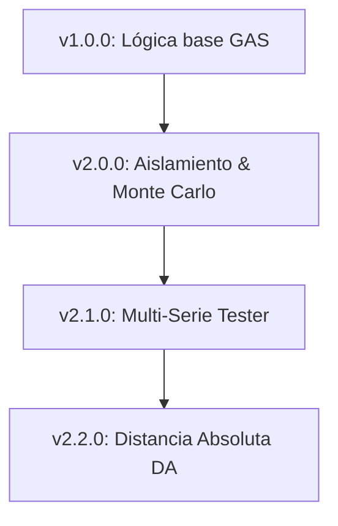

# 📊 Motor de Estadística ORION (Ficha Técnica y Control de Versiones)

Este documento centraliza toda la arquitectura matemática, fórmulas, lógica estadística y la estrategia de versionamiento de los motores de análisis estadístico en el sistema ORION.

---

## 🛠️ 1. Mapeo de Componentes en el Código Fuente
Los cálculos y análisis de probabilidad del sistema se distribuyen en los siguientes módulos:

*   **Motor de Distancia Absoluta (DA):**
    *   [DAEngine](file:///home/vcmsoporte/proyectos/orion/daEngine.js#L6) en `daEngine.js`: Calcula secuencias de atraso inter-impacto (distancias absolutas) para docenas, columnas, chances sencillas y series.
*   **Motor de Sesgo y Entropía (CHI² / Wilson):**
    *   [ChiAnalysisEngine](file:///home/vcmsoporte/proyectos/orion/chiLogic.js#L3) en `chiLogic.js`: Calcula el estadístico Chi-cuadrado y la presión de reversión.
    *   [WinWinEngine](file:///home/vcmsoporte/proyectos/orion/3_WinWin_Atrasos_CHI_Estrategias.js#L9) en `3_WinWin_Atrasos_CHI_Estrategias.js`: Implementa el escaneo profundo de historial, análisis de seisenas (atrasos vs récords), anomalías de la Ley del Tercio, rachas cortas (WinWin) y alertas de sesgo.
*   **Motor de Validación y Simulación (Monte Carlo):**
    *   [MonteCarloValidator](file:///home/vcmsoporte/proyectos/orion/monteCarloValidator.js#L19) en `monteCarloValidator.js`: Valida la confiabilidad del motor de análisis bajo hipótesis nula ($H_0$) y alternativa ($H_1$), además de evaluar la capacidad de reacción ante derivas (*Drift*).
    *   [statsWorker.js](file:///home/vcmsoporte/proyectos/orion/statsWorker.js): Hilo de ejecución secundario (Web Worker) para cálculos concurrentes de fondo sin bloquear el hilo principal de la interfaz de usuario.

---

## 📐 2. Formulaciones Matemáticas Clave

### A. Distancia Absoluta (DA)
Representa la diferencia de IDs (tiradas) entre dos aciertos consecutivos de un mismo grupo o serie numérica.
$$DA_i = Hit_i - Hit_{i-1}$$

*   **Aplicación:** Monitorear secuencias de retraso inter-hit y calcular el máximo de DA acumulado en la sesión de usuario para la mitigación del riesgo en apuestas.
*   **Colores Tácticos de DA en UI:**
    *   `1 a 9`: Blanco
    *   `10 a 18`: Celeste
    *   `19 a 30`: Amarillo
    *   `31 a 40`: Naranja
    *   `> 40`: Rojo (Riesgo máximo)

### B. Estadístico Chi-Cuadrado ($\chi^2$)
Utilizado para verificar la desviación de la frecuencia observada respecto a la teórica.

*   **Para un Grupo con 1 Grado de Libertad (Grupo vs Resto):**
    $$\chi^2 = \frac{(O - E)^2}{E} + \frac{(O_{resto} - E_{resto})^2}{E_{resto}}$$
    Donde $O$ es la frecuencia observada en el grupo, $E = N \times P_{teorica}$ es la frecuencia esperada, y $N$ es la ventana de giros.
*   **Para la Ruleta Completa (df = 37):**
    Evalúa si la distribución total es uniforme.

### C. Límite Inferior del Intervalo de Confianza de Wilson
Utilizado como filtro inteligente en el motor de análisis ORION para suprimir los falsos positivos derivados del azar de corto plazo.
$$\text{Lower Bound} = \frac{p + \frac{z^2}{2N} - z \sqrt{\frac{p(1-p)}{N} + \frac{z^2}{4N^2}}}{1 + \frac{z^2}{N}}$$

*   **Filtro Profesor_Orion:** La señal estadística solo se considera válida si el Límite Inferior de Wilson supera el azar teórico de un número de ruleta americana ($1/38 \approx 0.0263$):
    $$\text{Exceso} = \text{Lower Bound} - 0.0263$$
    $$\text{Score de Confianza} = \text{Exceso} \times 25$$

### D. Ley del Tercio
Evalúa la dispersión/concentración analizando la cantidad de números únicos en una ventana de giros $N$.
$$U_{esperados} = 38 \times \left(1 - \left(\frac{37}{38}\right)^N\right)$$

*   **Anomalía:** Se genera una alerta si el conteo observado difiere en más de un $\pm10\%$ de la predicción teórica.

### E. Varianza de Saltos (Firma del Crupier)
Determina la consistencia física del lanzamiento analizando la varianza del desplazamiento angular (salto) de la bola de un lanzamiento a otro en relación al cilindro.
*   **Firma Física (Varianza < 15):** Crupier altamente jugable por su patrón mecánico consistente.
*   **Normal (Varianza 15 a 40):** Comportamiento estándar.
*   **Caos (Varianza > 40):** Saltos erráticos; ruleta impredecible o crupier alternando velocidades.

---

## 📈 3. Protocolo de Validación Monte Carlo
Antes de aprobar cambios funcionales en los motores estadísticos, se debe correr una simulación de validación masiva que cumpla con los siguientes criterios de calidad bajo $H_0$ y $H_1$:

| Criterio | Métrica Objetivo | Significado Técnico |
| :--- | :--- | :--- |
| **Tasa de Falsos Positivos (FPR)** | $\le 5\%$ | Porcentaje de alertas falsas generadas bajo distribución uniforme perfecta ($H_0$). |
| **Tasa de Verdaderos Positivos (TPR - Bias)** | $\ge 60\%$ | Sensibilidad para detectar un sesgo físico de al menos $12\%$ en la ventana de análisis ($H_1$). |
| **TPR en Deriva (Drift)** | $\ge 40\%$ | Capacidad de captar un sesgo que progresa linealmente durante la sesión. |
| **Precisión Global** | $\ge 80\%$ | Ratio de aciertos/señales sobre el total de oportunidades generadas. |

---

## 🔄 4. Registro y Control de Versionamiento (End-to-End)

Este motor mantiene una línea de evolución estricta que requiere documentación detallada de cualquier cambio matemático o estructural.

### Historial de Cambios del Motor Estadístico:

#### **[v2.2.0] - 2026-05-18 (Versión Actual)**
*   **Mejoras:** Integración total de la metodología de **Distancia Absoluta (DA)** mediante `daEngine.js`.
*   **Visualización:** Gráficos multivariable en la pestaña "Series" reflejando los atrasos inter-hit acumulativos con opciones dinámicas de ordenamiento e interactividad con zoom en los charts.
*   **Estado:** Validado y en producción.

#### **[v2.1.0] - 2026-05-15**
*   **Mejoras:** Refactorización a arquitectura **Multi-Serie** en el módulo Tester.
*   **Impacto:** Permite evaluar múltiples combinaciones de series simultáneamente con administración paralela de estados financieros, balances y niveles de rachas concurrentes.
*   **Alineación Matemática:** Cambios en los operadores lógicos a relaciones estrictas ($<$ y $\ge$) para asegurar concordancia total con las hojas de cálculo Google Sheets de origen del usuario.

#### **[v2.0.0] - 2026-05-04**
*   **Mejoras:** Integración del motor pasivo ORION sobre el Core estable.
*   **Algoritmo:** Adición de límites de confianza de Wilson, tangente hiperbólica de normalización contra outliers, y análisis Chi-Cuadrado de 1 gl y 37 gl.
*   **Estabilidad:** Diseño desacoplado "Plug-and-Play". Si el motor ORION falla, la captura de tiradas de ruleta (`RouletteTracker`) y las estadísticas estables se mantienen ininterrumpidas.

---
**Instrucción para Agentes de Desarrollo (IA):**
Cualquier cambio futuro en las fórmulas de cálculo de este motor debe incrementar el número de versión según el estándar SemVer en este archivo, actualizar el diagrama evolutivo, y requerir una prueba de regresión con el framework `MonteCarloValidator` para certificar que las métricas de FPR y TPR se mantienen dentro de los rangos seguros de operación.
