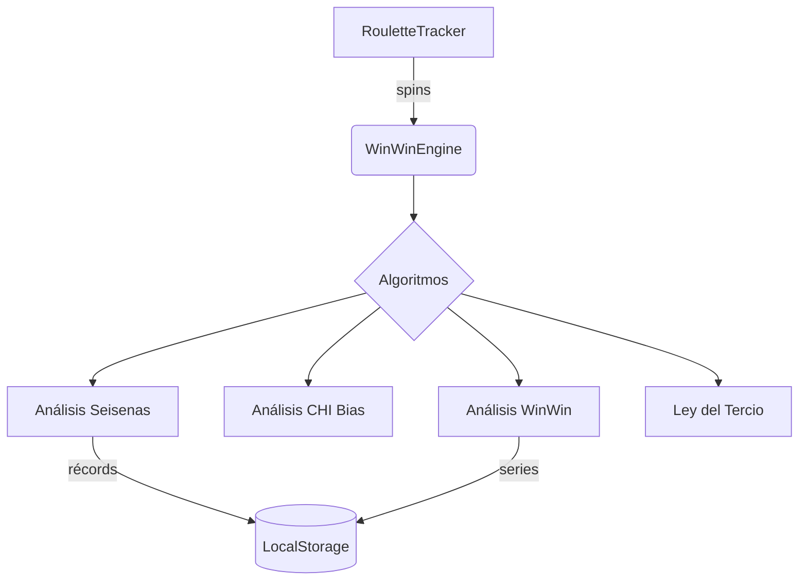
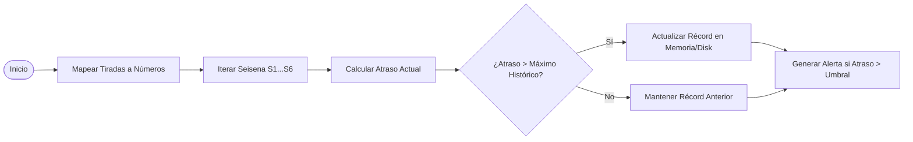
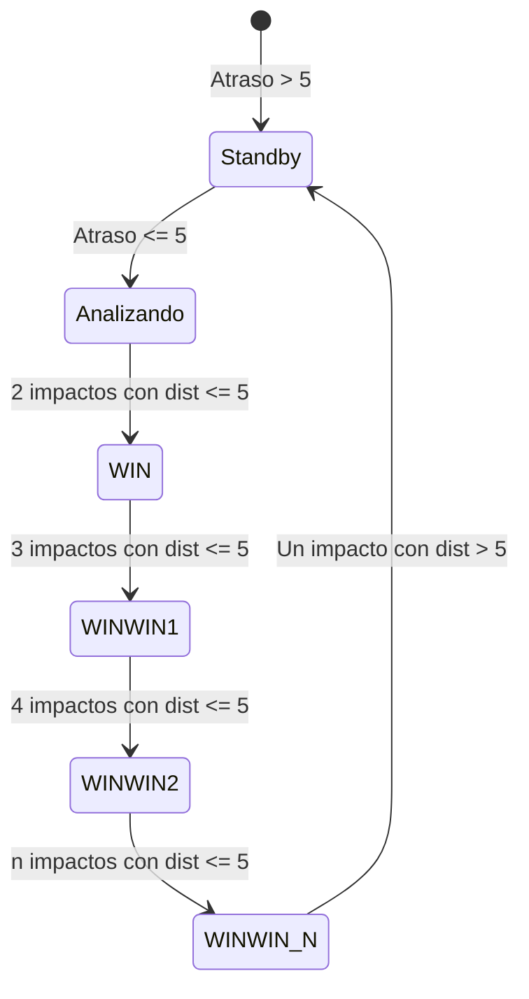
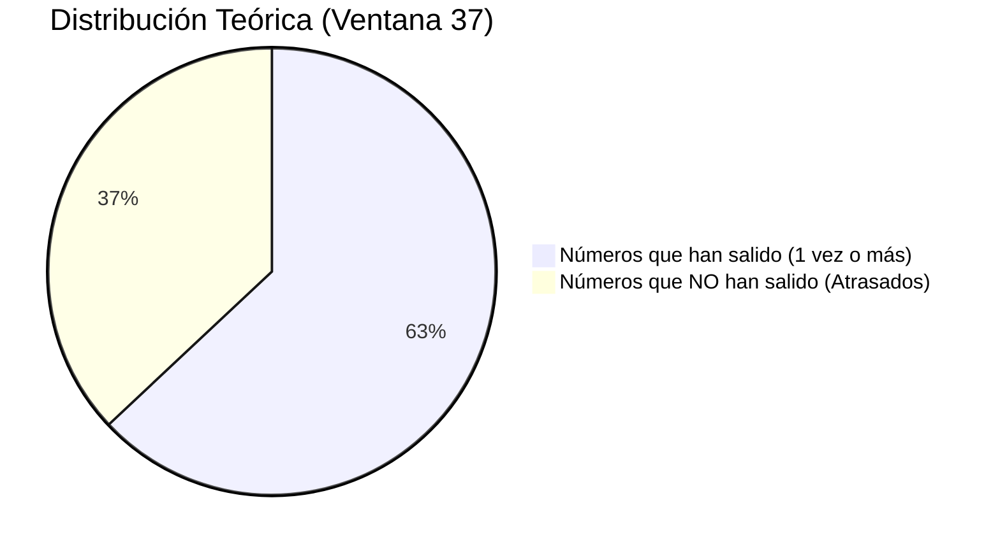

# 📊 Visualización Lógica: WinWin Engine

Este documento desglosa visualmente la arquitectura y los algoritmos implementados en `3_WinWin_Atrasos_CHI_Estrategias.js`.

## 🏗️ Estructura del Módulo

El motor opera como una clase independiente que consume el historial de tiradas del `RouletteTracker` y persiste los récords de la sesión en el almacenamiento local.

---

## 1. 🔄 Lógica de Seisenas (Atrasos vs Récords)
Calcula cuánto tiempo lleva sin salir cada grupo de 6 números y lo compara con el máximo histórico de la vida del usuario.

---

## 2. 🎯 Estrategia WinWin (Rachas Cortas)
Busca patrones de "repetición rápida". Si una serie sale varias veces seguidas con una distancia menor a 5 tiros, se activa el nivel WinWin.

---

## 3. 🔬 Análisis CHI (Detección de Sesgo)
Analiza una ventana (ej. 100 tiros) para encontrar números o apuestas con frecuencias anormales (Excesos/Déficits).

| Concepto | Cálculo | Interpretación |
| :--- | :--- | :--- |
| **Frec. Esperada (Núm)** | `Total / 38` | Cuántas veces "debería" salir cada número. |
| **Frec. Esperada (Apu)** | `Total / 2` | Cuántas veces "debería" salir Rojo/Negro, etc. |
| **Exceso (+)** | `Obs > Exp * (1 + u)` | El número está "caliente" (Sesgo positivo). |
| **Déficit (-)** | `Obs < Exp * (1 - u)` | El número está "frío" (Sesgo negativo). |

---

## 4. ⚖️ Ley del Tercio
Evalúa la dispersión de números únicos en una ventana de 37 tiros.

> [!TIP]
> **Anomalía**: Si los números únicos son mucho más de 24 o mucho menos de 24, la mesa está teniendo un comportamiento de dispersión o concentración atípico.
