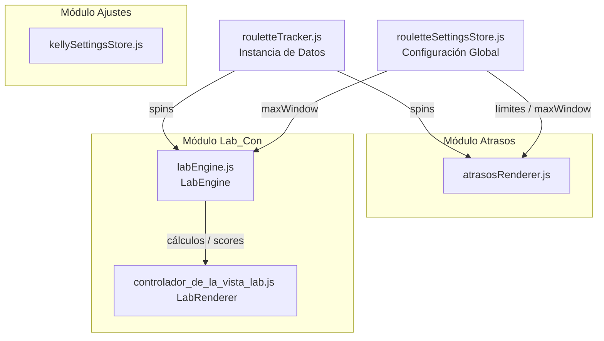

# 🔬 Bitácora y Arquitectura de Módulos - Roulette Tracker

Este documento detalla el análisis arquitectónico, la lógica matemática y la estructura de desacoplamiento de los módulos clave del proyecto *Roulette Tracker* (ubicado en `lab_vito`).

---

## 1️⃣ Contexto Matemático y Funcional de "Lab_Con" (Laboratorio Analítico)

La pestaña **Lab_Con** basa su lógica en la **Teoría de Conjuntos aplicada al análisis estocástico** para la ruleta. En lugar de apostar de forma simple a conjuntos tradicionales, busca solapamientos (intersecciones) entre conjuntos estresados (que tienen un retraso inusualmente alto frente a su máximo histórico). Esto reduce la cobertura de números necesarios y maximiza el retorno esperado.

### A. Cerebro Matemático: `labEngine.js`
* **Definición de Subconjuntos:** Mapea grupos clásicos de la ruleta (Rojo, Negro, Docenas, Columnas, Seisenas y Sectores) en `SUBCONJUNTOS`.
* **Cálculo de Atraso (`_getSetStats`):** Obtiene el retraso actual (`actualDelay`) y el retraso máximo observado (`maxDelay`) en el historial de giros.
* **Fórmula de Estrés Estocástico (`calcularPesoRetraso`):** Calcula la ponderación de estrés $w(S)$ de un conjunto basándose en la probabilidad de no aparición acumulada y el ratio del límite alcanzado:
  $$w(S) = \frac{\text{atraso\_actual}}{\text{atraso\_maximo}} \cdot (1.0 - (1 - p)^d)$$
* **Puntuación Individual por Número (`resolverScoresIndividuales`):** Suma las ponderaciones de estrés de todos los conjuntos activos que contienen a un número individual específico:
  $$Score(n) = \sum_{S_j} \mathbb{I}(n \in S_j) \cdot w(S_j)$$
* **Intersecciones Óptimas (`buscarInterseccionesOptimas`):** Evalúa pares de conjuntos con retraso significativo y calcula su eficiencia usando el ratio:
  $$\text{Eficiencia} = \frac{w(A) + w(B)}{|A \cap B|}$$

### B. Controlador e Interfaz de Usuario: `controlador_de_la_vista_lab.js`
* **`LabRenderer`:** Construye el tapete estocástico tricolor, la lista de perfiles de presión de conjuntos, el panel de los 5 números individuales más calientes (mayor estrés por pertenencia a conjuntos atrasados) y las tarjetas de sugerencia de cruces óptimos (eficiencia SPRT).
* **Interacción Reactiva:** Permite al usuario aplicar filtros de conjuntos en tiempo real y redibuja la vista de forma automática cada vez que entra un nuevo lanzamiento en el tracker.

---

## 2️⃣ Pestañas "Atrasos" y "Ajustes"

### A. Pestaña "Atrasos"
* **`atrasosRenderer.js`:** Renderizador autónomo que dibuja las tablas de rachas inactivas para las apuestas externas tradicionales (Suertes sencillas, Docenas, Columnas, Seisenas). Alerta visualmente en color naranja (límite alcanzado) y rojo (nivel crítico) mediante la función `renderAtrasosTab(tracker)`.

### B. Pestaña "Ajustes"
* **`rouletteSettingsStore.js`:** Es la base de datos persistente (IndexedDB) que almacena los valores de tolerancia definidos por el usuario (límites, ventana máxima de spins, parámetros de simulación y del Criterio de Kelly).
* **`main.js` (Formulario de Ajustes):** Sincroniza de forma bidireccional los inputs HTML de `index.html` con el almacén de configuración.

---

## 3️⃣ Verificación de Modularidad y Desacoplamiento

Todos los módulos y pestañas de la aplicación están **totalmente desacoplados entre sí**. No existen dependencias directas de imports entre `atrasosRenderer.js`, `controlador_de_la_vista_lab.js`, `orionRenderer.js` o `chiRenderer.js`. 

### Diagrama de Arquitectura y Flujo de Datos

### Funcionamiento de la Comunicación Directa
* **Independencia en Modificación:** Eliminar o cambiar el código UI de una pestaña no provoca errores ni afecta a las demás.
* **Orquestador Central (`main.js`):** Actúa como mediador, importando las vistas y enlazándolas al evento de actualización de spins del `RouletteTracker` global de forma aislada.
* **Flujo de Datos Unificado:** Las pestañas nunca se comunican entre sí. Todas las consultas se dirigen de manera vertical hacia el modelo de datos común (`tracker` y `settingsStore`).
