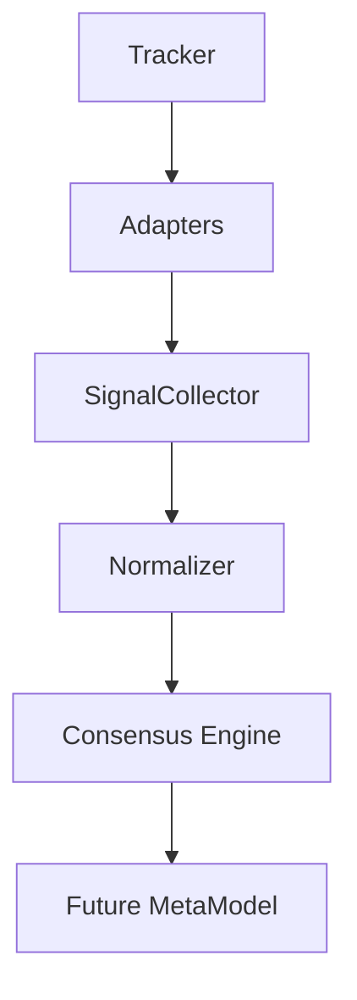

Fecha: 2026-07-29T22:40:33-04:00
Estado: COMPLETADO
Proyecto: Roulette Tracker (Orion)
Alcance: diseño del contrato de señales del MotorConsensoCalibrado sin modificar lógica productiva.

# 1. Resumen ejecutivo
- La Fase 0.5 se ejecutó como fase de arquitectura pura: no se tocaron motores, renderers, tests ni adaptadores productivos.
- El ecosistema actual ya expone señales suficientes para construir un contrato común entre Lab_Con, Lab_Con1 y AtRep, pero hoy esas señales están repartidas entre motores, managers, viewmodels y settings.
- La principal necesidad no es “inventar” señales nuevas, sino normalizar las existentes, separar evidencia de configuración y eliminar duplicaciones semánticas antes de implementar adaptadores.
- El contrato propuesto abajo define una única interfaz de entrada para el futuro `MotorConsensoCalibrado`: `ConsensusSignal`.
- Recomendación de estado para la Fase 1: GO CON CONDICIONES. La arquitectura objetivo es viable, pero conviene fijar normalización, ventana global y reglas de nulos antes de construir el `SignalCollector`.

# 2. Inventario completo de señales
## 2.1 Criterio de inventario
Se consideran señales no solo los scores finales, sino también los insumos observables, las derivadas internas, la configuración que altera el cálculo y los metadatos que permiten trazabilidad.

## 2.2 Tabla obligatoria
| Señal / familia | Motor | Método / origen | Tipo | Escala | Normalizar | Ventana | Configuración | Reutilizable | Significado |
| --- | --- | --- | --- | --- | --- | --- | --- | --- | --- |
| `session.active`, `session.startedAt`, `session.endedAt`, `session.spinCount` | Tracker | `src/tracker/SessionManager.js` | Metadato / Diagnóstico | booleano, ISO-8601, entero | No | No | No | Sí | Estado de vida de la sesión activa |
| `spins[].id`, `spins[].number`, `spins[].timestamp`, `spins[].casino`, `spins[].dealer`, `spins[].table` | Tracker | `src/tracker/SpinManager.js`, `src/tracker/RouletteTracker.js` | Observacional / Metadato | entero, token ruleta, ISO-8601, texto | Sí para `number` | Sí indirecta vía consumidores | Sí (metadatos desde settings) | Sí | Registro atómico de cada giro |
| `history[]`, `history.length`, `getLastSession()` | Tracker | `src/tracker/HistoryManager.js` | Metadato / Diagnóstico | array / entero / objeto | No | No | No | Sí | Historial de sesiones completadas |
| `atrasosMaxWindow` | Settings | `rouletteSettingsStore.js`, `SettingsManager.js` | Configuración | entero | Sí | Sí | Sí | Sí | Tamaño de ventana activa compartida |
| `moduleThresholds.{docenas,columnas,suertesSencillas,sixenas,plenos,seriesSectores}` | Settings | `rouletteSettingsStore.js` | Configuración | objetos `{limit, critical}` | Sí | Sí | Sí | Sí | Umbrales por módulo clásico |
| `moduleThresholds.{winwinEvenMoney,winwinDozensColumns,winwinSectors}` | Settings | `rouletteSettingsStore.js` | Configuración | objetos `{distanceMax}` | Sí | Sí | Sí | Sí | Umbrales de distancia Win-Win |
| `atRepTopK` | Settings | `rouletteSettingsStore.js` | Configuración | entero | Sí | Sí | Sí | Sí | Top-N visual del panel AtRep |
| `customSeries[].name`, `customSeries[].numbers`, `customSeries[].active` | Settings | `rouletteSettingsStore.js`, `loadCustomSeries()` | Configuración / Metadato | texto, lista, booleano | Sí | Sí | Sí | Sí | Series personalizadas activas |
| `sheetUrl`, `sheetName`, `sheetColumn`, `casinoName`, `crupierName`, `tableName` | Settings | `rouletteSettingsStore.js` | Metadato | texto | No | No | Sí | Sí | Contexto fuente / trazabilidad |
| `visualMode`, `showZeroes`, `showClear`, `showDozenDelays`, `showColumnDelays`, `showHighlights`, `showColZero`, `showColColor`, `showColParity`, `showColRange`, `showColDozens`, `showColColumns`, `showMuestra` | Settings | `rouletteSettingsStore.js` | Configuración / UI | booleano / enum | No | No | Sí | Parcial | Toggles de render y presentación |
| `colorAlert`, `parityAlert`, `highLowAlert`, `dozenAlert`, `columnAlert`, `seriesAlert`, `seisenaAlert`, `seisenaCritical`, `atrasosLimit`, `atrasosCritical` | Settings | `rouletteSettingsStore.js` | Configuración | entero | Sí | Sí | Sí | Sí | Umbrales de alerta legacy |
| `attackOrange`, `attackRed`, `confidenceColors`, `confidenceParity`, `confidenceRange`, `confidenceColumns` | Settings | `rouletteSettingsStore.js` | Configuración | entero | Sí | Sí | Sí | Sí | Parámetros de sensibilidad y confianza |
| `rangeExt`, `rangeDoc`, `rangeCHI`, `rangeChi`, `rangeLey`, `rangeWW`, `rangeAtr`, `rangeSeis` | Settings | `rouletteSettingsStore.js` | Configuración | entero | Sí | Sí | Sí | Sí | Rangos de análisis y calibración |
| `weaknessDistCount`, `sesgo97SectorSize`, `sesgo97TopSectorSize`, `sesgo97TopRanking`, `sesgo97StartRow`, `sesgo97EndRow` | Settings | `rouletteSettingsStore.js` | Configuración / Diagnóstico | entero | Sí | Sí | Sí | Sí | Parámetros auxiliares de diagnóstico |
| `getNumberDelay()`, `getNumberMaxDelay()` | DelayManager | `src/tracker/DelayManager.js` | Observacional / Derivada | entero | Sí | Sí | Sí | Sí | Atraso actual y máximo por número |
| `getDozenDelay()`, `getDozenMaxDelay()`, `getColumnDelay()`, `getColumnMaxDelay()` | DelayManager | `src/tracker/DelayManager.js` | Observacional / Derivada | entero | Sí | Sí | Sí | Sí | Atraso actual y máximo por docena/columna |
| `actualDelay`, `maxDelay` | Lab_Con | `labEngine.js:_getSetStats()` | Observacional / Derivada | entero | Sí | Sí | Sí | Sí | Atraso actual y máximo del conjunto |
| `weight` (`calcularPesoRetraso`) | Lab_Con | `labEngine.js:calcularPesoRetraso()` | Derivada | flotante 0..1 | Sí | Sí | Sí | Sí | Peso de estrés del conjunto |
| `hitProbability` | Lab_Con | `labEngine.js:getSetDetails()` | Observacional / Derivada | flotante 0..1 | Sí | No | No | Sí | Probabilidad teórica del conjunto |
| `pressure` | Lab_Con | `labEngine.js:getSetDetails()` | Derivada | flotante 0..1+ | Sí | Sí | Sí | Sí | Intensidad relativa frente al máximo observado |
| `resolverScoresIndividuales()` → score por número | Lab_Con | `labEngine.js` | Derivada | flotante acumulado | Sí | Sí | Sí | Sí | Suma de pesos de todos los conjuntos que contienen el número |
| `buscarInterseccionesOptimas()` → `combinacion`, `numeros`, `tamano_cobertura`, `peso_retraso`, `eficiencia_ratio` | Lab_Con | `labEngine.js` | Derivada / Diagnóstico | texto, lista, entero, flotante | Sí | Sí | Sí | Sí | Intersecciones binarias más útiles por eficiencia |
| `dists`, `atraso`, `level`, `isActive`, `threshold` | Lab_Con1 | `labCon1Engine.js:_getSetWinWinStats()` | Observacional / Derivada | lista, entero, texto, booleano | Sí | Sí | Sí | Sí | Distancias, atraso y estado Win-Win del conjunto |
| `weight` (`calcularPesoWinWin`) | Lab_Con1 | `labCon1Engine.js` | Derivada | flotante 0..1 | Sí | Sí | Sí | Sí | Peso final por racha Win-Win |
| `distsCount`, `pressure` | Lab_Con1 | `labCon1Engine.js:getSetDetails()` | Derivada / Diagnóstico | entero, flotante | Sí | Sí | Sí | Sí | Tamaño de evidencia y presión activa |
| `resolverScoresIndividuales()` → score por número | Lab_Con1 | `labCon1Engine.js` | Derivada | flotante acumulado | Sí | Sí | Sí | Sí | Suma de pesos Win-Win de los conjuntos activos |
| `buscarInterseccionesOptimas()` → `combinacion`, `numeros`, `tamano_cobertura`, `peso_retraso`, `eficiencia_ratio` | Lab_Con1 | `labCon1Engine.js` | Derivada / Diagnóstico | texto, lista, entero, flotante | Sí | Sí | Sí | Sí | Intersecciones eficientes por peso Win-Win |
| `occurrences`, `meanDist`, `expectedDist`, `pci`, `count`, `verdict` | AtRep | `atRepEngine.js:_calcSetPCI()` | Observacional / Derivada / Diagnóstico | entero, flotante, texto | Sí | Sí | Sí | Sí | Descripción PCI por conjunto |
| `occurrences`, `meanDist`, `expectedDist`, `pci`, `verdict` | AtRep | `atRepEngine.js:_calcNumberPCI()` | Observacional / Derivada / Diagnóstico | entero, flotante, texto | Sí | Sí | Sí | Sí | Descripción PCI por número individual |
| `getNumeroScores()` → `number`, `pci`, `verdict`, `setsIn`, `individualPci`, `groupPci` | AtRep | `atRepEngine.js` | Derivada / Diagnóstico | número/token, flotante, entero, texto | Sí | Sí | Sí | Sí | Contrato agregado por número |
| `getSetDetails()` → `name`, `label`, `type`, `numberScores[]` | AtRep | `atRepEngine.js` | Metadato / Diagnóstico | texto, lista | No parcial | Sí | Sí | Sí | Contrato de detalle por conjunto |
| `getGlobalSummary()` → `totalSets`, `attraction`, `repulsion`, `csr`, `insufficient` | AtRep | `atRepEngine.js` | Diagnóstico | entero | No | Sí | Sí | Sí | Resumen categórico de los conjuntos activos |
| `buscarInterseccionesOptimas()` → `label`, `numbers`, `count`, `avgPci`, `verdict` | AtRep | `atRepEngine.js` | Derivada / Diagnóstico | texto, lista, entero, flotante | Sí | Sí | Sí | Sí | Intersecciones con mejor desviación PCI |
| `summaryCards[]` (`totalSpins`, `activeSample`, `sets`, `observedGrouping`, `observedSeparation`) | AtRep ViewModel | `src/viewmodels/atRepViewModel.js` | Metadato / Diagnóstico | entero / lista | Sí | Sí | Sí | Sí | Resumen serializable de la pantalla |
| `scoreGrid[]` → `tone`, `pciFormatted`, `individualPci`, `groupPci`, `occurrences`, `ariaLabel` | AtRep ViewModel | `src/viewmodels/atRepViewModel.js` | Derivada / Metadato | enum, texto, flotante, entero | Sí | Sí | Sí | Sí | Contrato visual por celda de número |
| `setDetailsVM[]` → `meanDistFormatted`, `expectedDistFormatted`, `pciFormatted`, `tone` | AtRep ViewModel | `src/viewmodels/atRepViewModel.js` | Derivada / Metadato | texto, enum | Sí | Sí | Sí | Sí | Contrato visual por conjunto |
| `intersectionsVM[]` → `numbersDisplay`, `avgPciFormatted`, `tone` | AtRep ViewModel | `src/viewmodels/atRepViewModel.js` | Derivada / Metadato | texto, flotante | Sí | Sí | Sí | Sí | Contrato visual de intersecciones |
| `_meta` → `totalSpins`, `muestraActiva`, `maxWindow`, `universoTamaño`, `conjuntosActivos`, `conjuntosAtraccion`, `conjuntosRepulsion`, `conjuntosCSR`, `conjuntosInsuficientes` | AtRep ViewModel | `src/viewmodels/atRepViewModel.js` | Diagnóstico | entero | No | Sí | Sí | Sí | Telemetría del VM para debug |

## 2.3 Inventario resumido por familias
- Tracker de sesión: 4 señales elementales.
- Tracker de spins: 6 señales elementales en cada registro.
- Historial: 1 colección + contadores/último elemento.
- Configuración compartida: ventana global, umbrales por módulo, top-K AtRep, series personalizadas, metadatos y toggles UI.
- DelayManager: 6 señales elementales de atraso (3 dominios × actual/máximo).
- Lab_Con: 5 señales principales por conjunto más scores e intersecciones.
- Lab_Con1: 6 señales principales por conjunto más scores e intersecciones.
- AtRep: 6 señales principales de PCI por conjunto y por número, más agregaciones, resumen y metadatos de visualización.

# 3. Clasificación de señales
## 3.1 Observacionales
- `actualDelay`, `maxDelay`, `dists`, `atraso`, `occurrences`, `meanDist`, `expectedDist`, `pci`, `count`, `spins[].*`, `session.*` cuando reflejan estado real del dominio.
- Justificación: describen lo que ocurrió o lo que ya existe en la muestra.

## 3.2 Derivadas
- `weight`, `pressure`, `setsIn`, `groupPci`, `individualPci`, `avgPci`, `efficiency_ratio`, `scoreGrid.tone`, `summaryCards.items`, `score` por número.
- Justificación: se calculan a partir de observables y config.

## 3.3 Predictivas
- Ninguna señal actual debe clasificarse como predictiva en el sentido fuerte.
- `weight` y `pci` pueden orientar priorización, pero el código actual los trata como descriptivos/diagnósticos, no como predictores causales.

## 3.4 Configuración
- `atrasosMaxWindow`, `moduleThresholds.*`, `atRepTopK`, `customSeries`, umbrales legacy y toggles UI.
- Justificación: alteran la forma de calcular o presentar señales, pero no son evidencia en sí mismas.

## 3.5 Metadato
- `casinoName`, `dealer`, `table`, `sheetUrl`, `sheetName`, `sheetColumn`, `session.startedAt`, `session.endedAt`, `label`, `type`, `ariaLabel`.
- Justificación: identifican, contextualizan o permiten trazar origen y accesibilidad.

## 3.6 Diagnóstico
- `_meta`, `verdict`, `insufficient`, `isActive`, `globalSummary`, `intersections`, `pressure`.
- Justificación: facilitan decisión de UI y control de calidad de la muestra.

# 4. Escalas
## 4.1 Escalas por familia
- Atrasos: enteros discretos, escala absoluta en giros.
- Win-Win: flotantes normalizados entre 0 y 1 para `weight`, enteros en `threshold` y `atraso`.
- PCI: flotantes alrededor de 1.0, con cortes operativos en 0.95 y 1.05.
- Historial / sesiones: discretos y temporales.
- Configuración: enteros, booleanos, enums y listas.

## 4.2 Necesidad de normalización
- Sí para cualquier contrato unificado.
- Motivo: los motores hoy usan escalas distintas, ventanas distintas y semánticas parcialmente solapadas.
- Recomendación: normalizar a una escala común de evidencia por número, y conservar el valor crudo dentro de `rawSignals`.

# 5. Dependencias
## 5.1 Dependencias lógicas principales
- `Tracker` → fuente única de spins, historial, sesión y settings.
- `DelayManager` → depende de `getSpins()` y de la codificación de docenas/columnas.
- `Lab_Con` → depende de `atrasosMaxWindow` y `moduleThresholds`.
- `Lab_Con1` → depende de `atrasosMaxWindow`, `moduleThresholds` y del historial de números.
- `AtRep` → depende de `atrasosMaxWindow`, `atRepTopK` y del catálogo de conjuntos/series.
- `AtRep ViewModel` → depende de la forma exacta del engine y de settings.

## 5.2 Diagrama Mermaid


# 6. Correlación lógica
## 6.1 Matriz de relaciones
| Señal A | Señal B | Relación lógica | Intensidad | Razón |
| --- | --- | --- | --- | --- |
| `actualDelay` | `delayScore` / `weight` en Lab_Con | Muy correlacionada | Alta | El peso se construye a partir del atraso actual y su relación con el máximo |
| `actualDelay` | `maxDelay` | Muy correlacionada | Alta | El ratio actual/máximo define la presión del conjunto |
| `dists` | `level` | Muy correlacionada | Alta | El nivel Win-Win nace de la secuencia de distancias |
| `atraso` | `isActive` | Muy correlacionada | Alta | La activación depende de estar por debajo del threshold |
| `streakLength` | `winWinScore` / `weight` | Muy correlacionada | Alta | Mayor racha implica mayor peso |
| `pci` | `verdict` | Muy correlacionada | Alta | El veredicto es una clasificación del ratio PCI |
| `individualPci` | `groupPci` | Correlación media | Media | Comparten misma unidad y misma lógica de categorización, pero provienen de fuentes distintas |
| `groupPci` | `pciBySet` / `setDetails` | Correlación alta | Alta | Ambos describen el estado PCI de los conjuntos |
| `activeSets` | `summaryCards.sets` | Correlación estructural | Alta | El resumen visual replica la cardinalidad de conjuntos activos |
| `windowSize` | `muestraActiva` | Correlación estructural | Media | La muestra activa depende de la ventana, pero no la iguala |
| `delay family` | `winwin family` | Correlación baja | Baja | Ambos usan el mismo historial, pero miden fenómenos distintos |
| `delay family` | `PCI family` | Correlación baja | Baja | Uno mide ausencia reciente, el otro espaciamiento entre ocurrencias |

## 6.2 Lectura operativa
- La mayor redundancia está dentro de cada familia, no entre familias.
- La correlación cruzada entre Lab_Con y Lab_Con1 existe porque comparten ventana, spins y catálogo de conjuntos.
- AtRep comparte materia prima con los otros motores, pero su semántica es descriptiva, no de atraso.

# 7. Riesgo de redundancia
| Señal A | Señal B | Tipo de redundancia | Riesgo |
| --- | --- | --- | --- |
| `actualDelay` | `delayScore` / `weight` | Duplicación parcial | Medio |
| `delayRatio` | `weight` | Duplicación parcial | Medio |
| `dists` | `streakLength` | Duplicación parcial | Medio |
| `groupPci` | `pciCombined` / `pciBySet` | Duplicación alta | Alto |
| `individualPci` | `pci` en scoreGrid | Duplicación de representación | Bajo |
| `occurrences` | `sampleSize` | Relación complementaria, no duplicación | Bajo |
| `activeSets` | `setsIn` | Duplicación parcial | Medio |
| `summaryCards.totalSpins` | `Tracker.spins.length` | Duplicación de vista | Bajo |

## 7.1 Criterio de reducción
- Mantener el valor crudo y el valor derivado solo cuando cada uno aporte decisiones distintas.
- No duplicar la misma evidencia bajo dos nombres si la UI no lo requiere.
- En AtRep, priorizar `individualPci` como dato visible y dejar `groupPci` como interno si el formato final es de un solo círculo.

# 8. Contrato ConsensusSignal
## 8.1 Principio de diseño
- Unificar todo a un contrato por número, con capas separadas de evidencia cruda, agregación y metadatos.
- El contrato debe servir tanto para señales de atraso como para Win-Win y PCI sin perder trazabilidad.

## 8.2 Propuesta de interfaz
```typescript
interface ConsensusSignal {
  number: string; // soporta "0" y "00"
  sourceEngines: Array<'Lab_Con' | 'Lab_Con1' | 'AtRep'>;
  rawSignals: {
    delay?: {
      actualDelay: number;
      maxDelay: number;
      delayRatio: number;
      delayScore: number;
      probabilityDelay: number;
      pressure: number;
      activeSets: string[];
    };
    winWin?: {
      atraso: number;
      threshold: number;
      level: string | null;
      isActive: boolean;
      streakLength: number;
      streakBonus: number;
      recencyBonus: number;
      winWinScore: number;
    };
    pci?: {
      occurrences: number;
      meanDist: number | null;
      expectedDist: number | null;
      pciIndividual: number | null;
      pciCombined: number | null;
      pciBySet: Array<{ set: string; pci: number | null }>;
    };
  };
  evidence: {
    occurrences: number;
    sampleSize: number;
    activeSets: string[];
    windowSize: number;
    historyLength: number;
    supportCount: number;
  };
  metadata: {
    generatedAt: string;
    valid: boolean;
    warnings: string[];
    missingSignals: string[];
    provenance: Array<{ engine: string; method: string; version?: string }>;
  };
}
```

## 8.3 Justificación
- `number` debe ser `string` para preservar `0` y `00` sin pérdida.
- `rawSignals` mantiene los valores tal como los produce cada motor.
- `evidence` agrupa la muestra y el soporte disponible.
- `metadata` permite auditar origen, validez y huecos.

# 9. Adaptadores futuros
## 9.1 LabConAdapter
- Entra: `actualDelay`, `maxDelay`, `weight`, `pressure`, `hitProbability`, scores por número e intersecciones.
- Sale: `ConsensusSignal.rawSignals.delay`.
- Reutilización: alta. Debe envolver el motor actual, no copiarlo.

## 9.2 LabCon1Adapter
- Entra: `dists`, `atraso`, `level`, `isActive`, `threshold`, `weight`, `distsCount`.
- Sale: `ConsensusSignal.rawSignals.winWin`.
- Reutilización: alta. Debe encapsular el cálculo Win-Win y exponer solo el contrato.

## 9.3 AtRepAdapter
- Entra: `occurrences`, `meanDist`, `expectedDist`, `pci`, `verdict`, `setsIn`, `individualPci`, `groupPci`, `globalSummary`, intersecciones y VM.
- Sale: `ConsensusSignal.rawSignals.pci`.
- Reutilización: media-alta. Debe conservar `individualPci` como señal visible y relegar `groupPci` a soporte interno o de depuración.

# 10. Señales faltantes
Señales útiles que hoy no existen explícitamente y que convendría añadir en Fase 1 o 1.5:
- `consensusConfidence`: confianza agregada entre motores.
- `signalStability`: estabilidad temporal de una señal a lo largo de ventanas consecutivas.
- `crossEngineAgreement`: nivel de acuerdo entre Lab_Con, Lab_Con1 y AtRep.
- `sampleQuality`: calidad de la muestra, incluyendo densidad y cobertura.
- `signalDecaySlope`: pendiente de pérdida de fuerza con el tiempo.
- `redundancyIndex`: índice explícito de duplicación entre señales.
- `windowOverlap`: porcentaje de solapamiento entre ventanas de motores distintos.
- `nullDensity`: densidad de valores nulos o insuficientes.
- `evidenceDiversity`: diversidad de fuentes, conjuntos y familias analizadas.
- `trendDirection`: dirección temporal de la señal en ventanas sucesivas.

# 11. Riesgos
| Riesgo | Origen | Impacto | Probabilidad | Mitigación |
| --- | --- | --- | --- | --- |
| Duplicación de evidencia | Señales derivadas que repiten la misma información | Alto | Alta | Conservar solo una forma canónica por familia |
| Señales correlacionadas | Mismo historial alimentando tres motores | Medio | Alta | Etiquetar por familia y no sumar evidencias ciegamente |
| Estado mutable | `TrackerState` y managers comparten objetos mutables | Medio | Media | Copiar al entrar en el `ConsensusSignal` |
| Dependencias ocultas | Lectura directa de campos internos del engine | Alto | Media | Exponer métodos públicos o adaptadores |
| Escalas incompatibles | Atrasos, pesos y PCI están en unidades distintas | Alto | Alta | Normalizar antes de fusionar |
| Valores nulos | `pci=null`, `meanDist=null`, sin muestra | Medio | Alta | Marcar `valid=false` y registrar `warnings` |
| Ventanas distintas | Futuros motores podrían divergir de `atrasosMaxWindow` | Medio | Media | Fijar ventana efectiva en el contrato |
| Dependencia del renderer | Contrato visual no debe contaminar el contrato de señales | Medio | Media | Separar `ViewModel` del `ConsensusSignal` |
| Dependencia del ViewModel | UI puede reintroducir campos redundantes | Bajo | Media | Validar schema antes de renderizar |

# 12. Arquitectura objetivo
## 12.1 Cadena lógica
- `Tracker` provee la materia prima.
- `Adapters` traducen a `ConsensusSignal` sin perder origen.
- `SignalCollector` consolida señales por número y ventana.
- `Normalizer` homologa escalas y marca nulos.
- `Consensus Engine` fusiona señales.
- `Future MetaModel` consume la salida consensuada.

## 12.2 Principios
- Una sola ventana efectiva por contrato.
- Un solo número canónico por señal.
- Todo dato derivado debe ser trazable a su fuente.
- El contrato no debe depender del renderer ni del layout.

# 13. Recomendaciones para Fase 1
1. Construir `SignalCollector` como capa de extracción pura, sin UI.
2. Implementar `LabConAdapter`, `LabCon1Adapter` y `AtRepAdapter` como envoltorios, no como copias.
3. Definir schema de validación para `ConsensusSignal` antes de fusionar motores.
4. Congelar la normalización de `number` a `string` y reservar `null` solo para ausencia real.
5. Mantener `individualPci` como salida visible de AtRep y tratar `groupPci` como dato secundario.
6. Unificar la política de ventana en `atrasosMaxWindow` hasta que exista razón formal para separarla.
7. Añadir tests de contrato antes de mover lógica productiva.

# 14. Criterios de aceptación
- Existe inventario completo de señales actuales.
- Existe contrato `ConsensusSignal` documentado.
- Existe clasificación de señales por categoría.
- Existe análisis de correlación lógica.
- Existe matriz de redundancia.
- Existe mapa de adaptadores futuros.
- Existe lista de señales faltantes.
- Existe arquitectura objetivo clara.
- No se modificó código productivo.
- No se modificaron tests.

# 15. Conclusiones
- La base actual ya contiene suficiente información para unificar motores, pero hoy está dispersa en capas diferentes.
- La Fase 0.5 debe cerrar el lenguaje común antes de escribir cualquier adaptador real.
- El contrato propuesto prioriza trazabilidad, normalización y separabilidad entre evidencia y presentación.
- La siguiente fase recomendada es la implementación del `SignalCollector` y de los tres adaptadores.
- Esta fase se considera completada como diseño; el trabajo productivo queda aplazado explícitamente para Fase 1.
