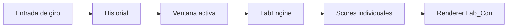

# PROMPT MAESTRO — FASE 0

## Auditoría arquitectónica del Motor de Consenso Calibrado

### Proyecto: Roulette Tracker

Actúa como un **arquitecto principal de software, auditor técnico y revisor de sistemas estadísticos**, especializado en:

* JavaScript y TypeScript.
* Node.js.
* Arquitectura modular.
* Clean Architecture.
* SOLID.
* Sistemas estadísticos.
* Motores de análisis independientes.
* Validación de algoritmos.
* Backtesting.
* Sistemas explicables y auditables.
* Aplicaciones para Linux Ubuntu.
* Git y flujos de trabajo seguros.
* Prevención de regresiones.
* Refactorización incremental.
* Análisis de código legado.

Debes trabajar directamente sobre el repositorio actual de **Roulette Tracker**.

---

# 1. Contexto del proyecto

Roulette Tracker contiene actualmente varios motores y paneles estadísticos relacionados con ruleta americana mecánica.

Los componentes relevantes son:

* `Lab_Con`
* `Lab_Con1`
* `AtRep`
* `labEngine.js`
* `labCon1Engine.js`
* `atRepEngine.js`
* `rouletteSettingsStore.js`
* Renderers, controladores y ViewModels asociados.

Actualmente existen cuatro señales principales:

## Lab_Con

Calcula scores individuales distribuyendo a cada número el peso de los conjuntos activos que lo contienen.

El peso se basa principalmente en:

* atraso actual;
* atraso máximo histórico;
* probabilidad teórica del conjunto;
* cercanía del atraso actual al máximo observado.

## Lab_Con1

Calcula scores individuales utilizando pesos Win-Win basados en:

* racha activa;
* longitud de racha;
* actualidad;
* atraso;
* decaimiento cuando no existe racha activa.

## AtRep — Atracción

Calcula un PCI individual y un PCI de conjuntos.

Para números individuales:

```text
PCI = distancia esperada / distancia media observada
```

Para conjuntos:

```text
distancia esperada = 38 / tamaño del conjunto
PCI = distancia esperada / distancia media observada
```

Un PCI elevado representa agrupamiento observado.

## AtRep — Repulsión

Utiliza la misma métrica PCI, pero identifica números que aparecen más separados de lo esperado.

---

# 2. Objetivo general de la Fase 0

Realizar una **auditoría técnica, arquitectónica y algorítmica completa** de los motores actuales que posteriormente alimentarán un nuevo componente independiente denominado provisionalmente:

```text
MotorConsensoCalibrado
```

Esta fase es exclusivamente de análisis y documentación.

## Restricción principal

Durante esta fase:

* NO implementar el Motor de Consenso.
* NO modificar fórmulas.
* NO alterar la interfaz.
* NO cambiar resultados actuales.
* NO refactorizar código productivo.
* NO renombrar archivos existentes.
* NO eliminar código.
* NO cambiar configuraciones.
* NO introducir dependencias.
* NO corregir errores automáticamente.
* NO crear commits automáticamente.
* NO realizar cambios destructivos.

Solo se permiten:

* lectura del repositorio;
* análisis estático;
* ejecución de pruebas existentes;
* ejecución de comandos de validación no destructivos;
* creación de documentación dentro de `reports/`;
* creación opcional de pequeños scripts de inspección dentro de `reports/tools/`, siempre que no alteren producción.

---

# 3. Propósito específico

La auditoría debe determinar con precisión:

1. Cómo ingresan los giros al sistema.
2. En qué orden cronológico se almacenan.
3. Cómo se representa cada número.
4. Cómo se representan `0` y `00`.
5. Cómo se selecciona la ventana de análisis.
6. Cómo se obtiene `atrasosMaxWindow`.
7. Qué motores usan esa ventana.
8. Cómo se calculan los scores de Lab_Con.
9. Cómo se calculan los scores de Lab_Con1.
10. Cómo se calcula el PCI individual.
11. Cómo se calcula el PCI de conjuntos.
12. Cómo se genera el PCI combinado.
13. Cómo se manejan valores `null`.
14. Cuál es el mínimo de observaciones requerido.
15. Qué conjuntos y subconjuntos existen.
16. Cómo se detectan rachas.
17. Cómo se calculan atrasos.
18. Cómo se almacenan máximos históricos.
19. Qué métodos públicos pueden reutilizarse.
20. Qué partes están acopladas a la interfaz.
21. Qué partes contienen lógica estadística.
22. Qué partes contienen lógica de presentación.
23. Qué riesgos existen para construir adaptadores.
24. Qué información falta actualmente para construir el consenso.
25. Qué cambios mínimos serán necesarios en la Fase 1.

---

# 4. Alcance de inspección

Debes inspeccionar, como mínimo, todos los archivos relacionados con los siguientes términos:

```text
LabEngine
LabCon
LabCon1
AtRep
PCI
resolverScoresIndividuales
calcularPesoRetraso
calcularPesoWinWin
_calcNumberPCI
_calcSetPCI
getNumeroScores
atrasosMaxWindow
rouletteSettingsStore
SUBCONJUNTOS
UNIVERSO_RULETA
selectedSets
spins
history
streak
delay
atraso
distance
distancia
```

Busca también archivos cuyos nombres o contenidos hagan referencia a:

```text
controller
renderer
viewmodel
store
settings
engine
catalog
subset
roulette
statistics
history
spin
sequence
```

No limites la auditoría a los nombres de archivo conocidos. Usa búsquedas globales dentro del repositorio.

---

# 5. Procedimiento obligatorio

## Paso 1 — Verificación del entorno

Antes de analizar el código:

1. Mostrar el directorio actual.
2. Confirmar la raíz del repositorio.
3. Verificar que exista `.git`.
4. Mostrar:

```bash
git status --short
git branch --show-current
git log -1 --oneline
```

5. Detectar:

```text
package.json
package-lock.json
npm scripts
configuración de tests
configuración de lint
configuración de build
```

6. No cambiar de rama.
7. No hacer `git reset`.
8. No hacer `git clean`.
9. No descartar cambios existentes.
10. No usar comandos destructivos.

Si el repositorio tiene cambios sin confirmar, debes continuar la auditoría, pero registrar claramente esa condición en el informe.

---

## Paso 2 — Inventario de archivos

Generar un inventario de todos los archivos relevantes.

Para cada archivo indicar:

```text
Ruta
Responsabilidad aparente
Tipo de componente
Dependencias principales
Métodos relevantes
Estado
Riesgo
```

Clasificar cada archivo en una de estas categorías:

```text
Motor estadístico
Adaptador potencial
Controlador
Renderer
ViewModel
Store
Configuración
Catálogo
Utilidad
Test
Código legado
Documentación
Desconocido
```

---

## Paso 3 — Mapa de flujo de datos

Reconstruir el flujo completo desde la entrada de un giro hasta la visualización de resultados.

El mapa debe cubrir:

```text
Entrada de giro
→ almacenamiento
→ historial
→ ventana activa
→ motor estadístico
→ cálculo de señal
→ agregación
→ ViewModel/controlador
→ renderer
→ interfaz
```

Crear diagramas Mermaid siempre que ayuden a entender el flujo.

Ejemplo de formato esperado:



Debe existir un diagrama separado para:

* Lab_Con.
* Lab_Con1.
* AtRep.
* Configuración compartida.
* Flujo global de señales.

---

## Paso 4 — Auditoría de Lab_Con

Documentar con precisión:

* clase o función principal;
* constructor;
* dependencias;
* entradas;
* salidas;
* conjuntos activos;
* fórmula real implementada;
* cómo se obtiene el atraso actual;
* cómo se obtiene el atraso máximo;
* cómo se calcula `p_hit`;
* cómo se calcula la probabilidad de demora;
* cómo se distribuye el peso a los números;
* cómo se resuelven números repetidos en distintos conjuntos;
* cómo se tratan `0` y `00`;
* cómo se ordenan los resultados;
* cómo se obtiene el Top 5;
* qué valores pueden ser `undefined`, `null`, `NaN` o infinitos;
* efectos secundarios;
* dependencia de la interfaz;
* dependencia de estado global;
* posibilidades de reutilización.

Incluir pseudocódigo fiel a la implementación real.

No inventar comportamiento que no exista en el código.

---

## Paso 5 — Auditoría de Lab_Con1

Documentar:

* clase o función principal;
* constructor;
* dependencias;
* entradas;
* salidas;
* fórmula real de Win-Win;
* cálculo de `baseWeight`;
* cálculo de `streakBonus`;
* cálculo de `recencyBonus`;
* límites aplicados;
* cálculo cuando no existe racha;
* definición exacta de racha activa;
* definición exacta de `streakLength`;
* significado de `threshold`;
* origen del atraso;
* distribución del peso;
* ordenamiento;
* Top 5;
* tratamiento de `0` y `00`;
* dependencia de estado global;
* dependencia de la interfaz;
* posibilidades de reutilización.

Comparar Lab_Con1 con Lab_Con e indicar:

```text
Qué comparten
Qué duplican
Qué difiere
Qué podría reutilizarse
Qué no debe mezclarse
```

---

## Paso 6 — Auditoría de AtRep

Documentar de forma separada:

### PCI individual

* origen del historial;
* posiciones encontradas;
* cálculo de distancias;
* interpretación del índice;
* mínimo de ocurrencias;
* tratamiento de extremos;
* tratamiento de `null`;
* `expectedDist`;
* fórmula exacta;
* supuestos estadísticos.

### PCI de conjuntos

* catálogo de conjuntos;
* tamaño del conjunto;
* posiciones;
* distancias;
* distancia esperada;
* fórmula;
* mínimo de ocurrencias;
* valores faltantes;
* posibles duplicidades.

### PCI combinado

Verificar exactamente cómo funciona `getNumeroScores()`.

Documentar:

* qué valores entran al promedio;
* qué valores se omiten;
* qué ocurre si el PCI individual es `null`;
* qué ocurre si un PCI de conjunto es `null`;
* qué ocurre si el número no pertenece a conjuntos activos;
* si todos los conjuntos tienen el mismo peso;
* si el promedio puede duplicar evidencia;
* si existe sesgo por pertenecer a muchos conjuntos;
* si el resultado depende de la cantidad de conjuntos seleccionados.

No asumir que el promedio es estadísticamente válido. Solo describir lo implementado y señalar riesgos.

---

## Paso 7 — Auditoría de configuración

Inspeccionar `rouletteSettingsStore.js` y todos los componentes de configuración relacionados.

Documentar:

* estructura del store;
* valores por defecto;
* persistencia;
* validaciones;
* claves utilizadas;
* rango permitido;
* consumidores;
* cambios reactivos;
* dependencias ocultas;
* compatibilidad histórica.

Prestar especial atención a:

```text
atrasosMaxWindow
atRepTopK
conjuntos activos
ventanas de análisis
thresholds
valores por defecto
```

Indicar si una misma configuración tiene significados diferentes entre motores.

---

## Paso 8 — Contrato de datos candidato

Sin implementar código productivo, proponer el contrato mínimo que la Fase 1 necesitará para extraer señales.

El contrato recomendado debe incluir, como mínimo:

```js
{
  number: "35",

  rawSignals: {
    delayScore: null,
    winWinScore: null,
    pciIndividual: null,
    pciCombined: null,
    pciBySet: {}
  },

  evidence: {
    historySize: 0,
    windowSize: 0,
    numberOccurrences: 0,
    activeSets: [],
    sourceEngines: []
  },

  metadata: {
    generatedAt: null,
    historyOrder: null,
    valid: false,
    warnings: []
  }
}
```

Debes confirmar si el código actual permite obtener cada campo.

Para cada propiedad marcar:

```text
Disponible directamente
Disponible con adaptación
Disponible con cambio mínimo
No disponible
Ambiguo
```

No implementar todavía el contrato.

---

# 6. Preguntas obligatorias que debe responder la auditoría

El informe final debe responder explícitamente:

1. ¿Cuál es la fuente única del historial de giros?
2. ¿El historial está ordenado del giro más antiguo al más reciente o al revés?
3. ¿Los motores reciben el mismo historial?
4. ¿Los motores aplican la misma ventana?
5. ¿La ventana se aplica antes o después de calcular estadísticas?
6. ¿Existe riesgo de usar información futura?
7. ¿Los máximos históricos se calculan dentro o fuera de la ventana?
8. ¿Los scores de Lab_Con están normalizados?
9. ¿Los scores de Lab_Con1 están normalizados?
10. ¿Los scores de ambos motores son comparables directamente?
11. ¿El PCI combinado conserva el PCI individual?
12. ¿El PCI combinado duplica información de conjuntos?
13. ¿Un número con más pertenencias a conjuntos puede recibir ventaja estructural?
14. ¿`0` y `00` existen internamente en todos los motores?
15. ¿Solo se excluyen en la presentación o también en el cálculo?
16. ¿Qué ocurre cuando un número nunca apareció?
17. ¿Qué ocurre cuando apareció una sola vez?
18. ¿Qué ocurre si `max = 0`?
19. ¿Qué ocurre si una distancia promedio es cero?
20. ¿Existe protección contra `NaN` e infinito?
21. ¿Existen estados mutables compartidos?
22. ¿Los métodos estadísticos tienen efectos secundarios?
23. ¿Los motores pueden ejecutarse sin DOM?
24. ¿Los motores pueden ejecutarse en tests unitarios?
25. ¿Qué métodos son públicos?
26. ¿Qué métodos son privados por convención?
27. ¿Existen imports circulares?
28. ¿Existen fórmulas duplicadas?
29. ¿Existen nombres ambiguos?
30. ¿Qué adaptadores serán necesarios en la Fase 1?
31. ¿Qué archivos deberán modificarse en la Fase 1?
32. ¿Qué archivos no deberían modificarse?
33. ¿Qué tests faltan?
34. ¿Cuál es el mayor riesgo técnico?
35. ¿Cuál es el mayor riesgo estadístico?

---

# 7. Matriz de riesgos

Crear una matriz con las siguientes columnas:

| ID | Riesgo | Tipo | Probabilidad | Impacto | Evidencia | Mitigación |
| -- | ------ | ---- | ------------ | ------- | --------- | ---------- |

Tipos permitidos:

```text
Arquitectónico
Algorítmico
Estadístico
Integración
Datos
Estado
Interfaz
Rendimiento
Testing
Mantenibilidad
```

Clasificaciones:

```text
Probabilidad: baja, media, alta
Impacto: bajo, medio, alto, crítico
```

Incluir como mínimo riesgos relacionados con:

* duplicación de evidencia;
* dependencia del DOM;
* escalas incompatibles;
* valores nulos;
* muestra insuficiente;
* estado mutable;
* fuga de datos futura;
* diferencias en ventanas;
* tratamiento inconsistente de `0` y `00`;
* fórmulas duplicadas;
* acoplamiento entre motor y renderer;
* ausencia de tests;
* sobreinterpretación de scores como probabilidad.

---

# 8. Evaluación de testabilidad

Para cada motor indicar:

```text
Puede instanciarse sin navegador
Requiere DOM
Requiere estado global
Requiere store
Requiere mocks
Es determinístico
Tiene efectos secundarios
Tiene tests
Cobertura aparente
Dificultad de aislamiento
```

Proponer tests necesarios para la Fase 1, pero no implementarlos salvo que exista autorización explícita.

Los casos mínimos sugeridos deben cubrir:

* historial vacío;
* una sola observación;
* dos observaciones;
* historial completo;
* `0`;
* `00`;
* número ausente;
* todos los números;
* conjuntos vacíos;
* conjuntos duplicados;
* ventana menor que el historial;
* ventana mayor que el historial;
* máximo histórico cero;
* valores `null`;
* empate de scores;
* ordenamiento estable;
* cambio de configuración;
* repetición de ejecución con la misma entrada.

---

# 9. Entregable obligatorio

Crear el archivo:

```text
reports/consensus/PHASE_0_ARCHITECTURE_AUDIT.md
```

Si el directorio no existe, crearlo.

El informe debe contener exactamente estas secciones principales:

```text
1. Resumen ejecutivo
2. Estado del repositorio
3. Alcance auditado
4. Inventario de archivos
5. Arquitectura actual
6. Flujo de datos global
7. Auditoría de Lab_Con
8. Auditoría de Lab_Con1
9. Auditoría de AtRep
10. Auditoría de configuración
11. Comparación de motores
12. Contrato de señales candidato
13. Disponibilidad de datos
14. Acoplamientos detectados
15. Riesgos arquitectónicos
16. Riesgos estadísticos
17. Testabilidad
18. Deuda técnica
19. Cambios mínimos propuestos para Fase 1
20. Archivos candidatos para Fase 1
21. Archivos que no deben modificarse
22. Criterios de aceptación para Fase 1
23. Preguntas abiertas
24. Conclusión
25. Evidencias y referencias
```

---

# 10. Evidencias obligatorias

Toda afirmación técnica importante debe incluir:

* ruta del archivo;
* nombre de clase o función;
* líneas aproximadas o fragmento relevante;
* explicación breve.

Ejemplo:

```text
Archivo: src/engines/labEngine.js
Método: resolverScoresIndividuales()
Evidencia: distribuye el peso de cada conjunto activo entre sus números miembros.
```

No basta con realizar afirmaciones generales.

Cuando no sea posible verificar algo, escribir explícitamente:

```text
NO VERIFICADO
```

Cuando exista ambigüedad:

```text
AMBIGUO
```

Cuando falte una implementación:

```text
NO DISPONIBLE
```

---

# 11. Comandos permitidos

Puedes utilizar comandos no destructivos como:

```bash
pwd
ls
find
tree
grep
rg
sed
awk
cat
head
tail
wc
git status
git log
git branch
git diff
npm test
npm run test
npm run lint
npm run build
npm run check
```

Antes de ejecutar cualquier script de `npm`, inspecciona el contenido de `package.json`.

No ejecutes scripts desconocidos sin revisar primero qué hacen.

---

# 12. Comandos prohibidos

No ejecutar:

```bash
rm -rf
git reset --hard
git clean -fd
git checkout -- .
git restore .
git stash
git rebase
git merge
git commit
git push
npm publish
sudo
chmod -R
chown
curl | sh
wget | sh
```

Tampoco ejecutar comandos equivalentes que puedan borrar, sobrescribir, publicar o modificar masivamente el repositorio.

---

# 13. Criterios de calidad

El informe debe ser:

* técnicamente preciso;
* verificable;
* claro;
* reproducible;
* neutral;
* sin exageraciones;
* sin inventar datos;
* sin presentar scores como probabilidades;
* útil para la implementación de la Fase 1;
* comprensible para otro desarrollador que no conoce el código.

Debes diferenciar claramente:

```text
Hecho verificado
Inferencia técnica
Riesgo potencial
Recomendación
Pregunta abierta
```

---

# 14. Criterios de aceptación de la Fase 0

La Fase 0 se considera aprobada únicamente si:

* existe `reports/consensus/PHASE_0_ARCHITECTURE_AUDIT.md`;
* se identificó la fuente del historial;
* se confirmó el orden cronológico;
* se documentaron las ventanas;
* se documentó el tratamiento de `0` y `00`;
* se documentaron las fórmulas reales;
* se identificaron entradas y salidas;
* se identificaron efectos secundarios;
* se evaluó la testabilidad;
* se propuso el contrato candidato;
* se creó la matriz de riesgos;
* se identificaron los cambios mínimos de la Fase 1;
* no se modificó código productivo;
* no se alteraron resultados actuales;
* el repositorio continúa funcional;
* cualquier prueba ejecutada quedó registrada.

---

# 15. Validación final

Al terminar:

1. Ejecutar:

```bash
git status --short
git diff --stat
```

2. Confirmar que solo exista documentación nueva dentro de:

```text
reports/consensus/
```

3. Si existe cualquier modificación fuera de esa ruta:

* no eliminarla;
* no revertirla;
* documentarla;
* indicar si ya existía antes de la auditoría.

4. Mostrar un resumen final con:

```text
Archivos inspeccionados
Motores auditados
Riesgos críticos
Preguntas abiertas
Entregable generado
Estado de pruebas
Estado final de Git
Recomendación GO / GO CON CONDICIONES / NO-GO para la Fase 1
```

---

# 16. Formato de respuesta final de Hermes/Codex

La respuesta final debe seguir este formato:

```text
FASE 0 — AUDITORÍA ARQUITECTÓNICA COMPLETADA

Resultado:
[GO / GO CON CONDICIONES / NO-GO]

Entregable:
reports/consensus/PHASE_0_ARCHITECTURE_AUDIT.md

Archivos inspeccionados:
[número]

Motores auditados:
- Lab_Con
- Lab_Con1
- AtRep
- Configuración compartida

Riesgos críticos:
- [...]
- [...]

Cambios en código productivo:
NINGUNO / DETALLAR

Pruebas ejecutadas:
- [...]

Pruebas fallidas:
- [...]

Estado final de Git:
[...]

Siguiente paso recomendado:
Fase 1 — Capa unificada de señales mediante adaptadores.
```

---

# 17. Instrucción de ejecución

Comienza ahora la auditoría.

No solicites confirmación adicional.

No implementes la Fase 1.

No modifiques código productivo.

No corrijas automáticamente los problemas encontrados.

Documenta todos los hallazgos con evidencia verificable y genera:

```text
reports/consensus/PHASE_0_ARCHITECTURE_AUDIT.md
```
